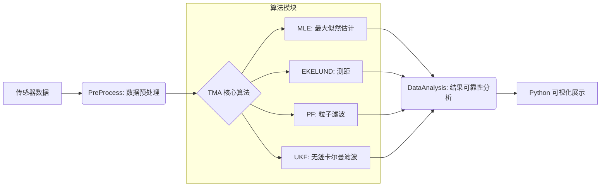

# TMA (Target Motion Analysis) Project

这是一个用于目标运动分析 (Target Motion Analysis, TMA) 的 C++ 项目。项目包含了多种估计算法，旨在通过观测数据（如方位角、频率等）对目标的运动状态（位置、速度）进行估计。

## 项目结构

**注意：目前仅集成了 纯方位的MLE (最大似然估计) 算法，其他模块 (EKELUND, PF, UKF) 正在开发中，将陆续集成。**

- **COMMON**: 公共数据结构和常量定义。
- **PreProcess**: 数据预处理算法，负责对原始观测数据进行清洗、滤波和格式化。
- **DataAnalysis**: 算法效果实时分析模块，用于评估 TMA 算法的估计效果的准确性。
- **EKELUND**: (待集成) Ekelund 测距算法实现。
- **MLE**: (已集成) 最大似然估计 (Maximum Likelihood Estimation) 算法，基于 Ceres Solver 进行非线性最小二乘优化。
- **PF**: (待集成) 粒子滤波 (Particle Filter) 算法实现。
- **UKF**: (待集成) 无迹卡尔曼滤波 (Unscented Kalman Filter) 算法实现。


## 项目流程图

以下 MERMAID 流程图展示了从原始观测数据到最终可视化结果的完整处理链路：



## 开发计划
- [x] **MLE 算法**: 完成纯方位最大似然估计算法集成 (基于 Ceres)。
- [x] **其他 TMA 算法**: 
    - [x] **EKELUND**: 实现 Ekelund 测距算法。
    - [x] **UKF**: 实现无迹卡尔曼滤波算法。
    - [x] **PF**: 实现粒子滤波算法。
- [x] **数据预处理 (PreProcess)**: 实现传感器数据的清洗、去噪和野值剔除。
- [x] **结果可靠性分析 (DataAnalysis)**: 
    - [x] **CRLB**: 计算克拉美罗下界，作为理论精度基准。
    - [x] **蒙特卡洛仿真**: 统计大量随机实验的均值与方差，验证算法的无偏性和有效性。
    - [x] **误差椭圆**: 基于协方差矩阵绘制置信区域，直观展示不确定性。
    - [x] **残差分析**: 检查观测残差统计特性，判断收敛质量。
- [ ] **可视化**: 开发 Python 脚本以可视化目标轨迹、观测数据和估计误差。

## 算法性能探讨

关于 **贝叶斯滤波算法 (EKF, SIR, RPF)** 与 **MLE (最大似然估计)** 的性能对比：
EKELUND算法没有做过很多研究，这里是使用Gemini3生成的算法代码，感觉效果不如现代TMA算法（如UKF）。
目前实验表明，在**单平台** TMA 场景下，**贝叶斯滤波类算法的参数估计准确性远不如 MLE**。
> 贝叶斯算法的过程噪声都需要细条，这里就不演示。

*   **个人观点**：贝叶斯滤波算法的优势主要在于**多源信息融合**能力，而在处理单平台纯方位观测数据时，其精度往往难以达到 MLE 的水平。
*   **开源求助**：如果您对解决贝叶斯滤波算法精度低的问题有相关经验或解决方案，**希望能有大佬给出指导或 PR**。我们非常欢迎关于提升 EKF/SIR/RPF 在 TMA 中精度的讨论与贡献。

## 依赖库

本项目依赖以下第三方库，请确保在构建前已正确安装：

1.  **Ceres Solver**
    - 用于解决非线性最小二乘问题，主要在 MLE 模块中使用。
    - [官方网站](http://ceres-solver.org/)

2.  **Eigen3**
    - C++ 模板库，用于线性代数运算。Ceres Solver 强依赖于 Eigen。
    - [官方网站](https://eigen.tuxfamily.org/)

## 构建说明

本项目使用 CMake 进行构建。

### 1. 配置第三方库路径

#### Windows 平台
本项目默认的第三方库目录结构如下，请确保你的 `3rdparty` 目录结构与此一致，否则请修改 CMake 文件：

```text
TMA/
└── 3rdparty/
    ├── ceres_part/
    │   ├── bin/
    │   │   ├── Debug/
    │   │   │   ├── ceres-debug.lib
    │   │   │   ├── gflags_debug.lib
    │   │   │   └── glogd.lib
    │   │   └── Release/
    │   │       ├── ceres.lib
    │   │       ├── gflags.lib
    │   │       └── glog.lib
    │   └── include/
    │       ├── ceres/
    │       ├── gflags/
    │       └── glog/
    └── eigen-3.4.0/
```

如果你的库路径不同，可以通过设置 `TMA_3RD_PARTY_DIR` 变量来指定查找路径。

#### Linux 平台
Linux 用户通常通过包管理器安装库（如 `apt install libceres-dev libeigen3-dev`）。
你需要自行修改 `CMakeLists.txt`，移除 Windows 特定的库路径设置，改用标准的 `find_package(Ceres)` 和 `find_package(Eigen3)`。

### 2. 编译步骤

```bash
mkdir build
cd build
cmake ..
cmake --build .
```

## 使用示例


## 许可证

本项目采用 [MIT License](LICENSE) 开源许可证。
您可以自由地使用、修改和分发本项目代码，但需保留原作者版权声明。


> **⚠️ 项目暂停公告**  
> 作者已暂停本项目的后续开发，全力备考软考。  
> 预计恢复时间：考试结束后。  
> 感谢各位的关注与理解，欢迎先 Star & Fork，后续将继续迭代！

