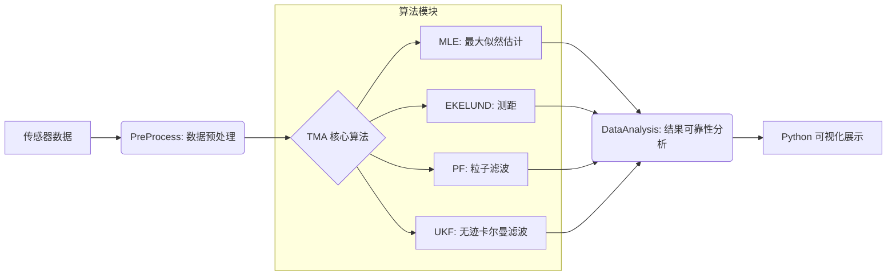

# TMA (Target Motion Analysis) Project

这是一个用于目标运动分析 (Target Motion Analysis, TMA) 的 C++ 项目。项目包含了多种估计算法，旨在通过观测数据（如方位角、频率等）对目标的运动状态（位置、速度）进行估计。

## 项目结构

**注意：目前仅集成了 纯方位的MLE (最大似然估计) 算法，其他模块 (EKELUND, PF, UKF) 正在开发中，将陆续集成。**

- **COMMON**: 公共数据结构和常量定义。
- **PreProcess**: 数据预处理算法，负责对原始观测数据进行清洗、滤波和格式化。
- **DataAnalysis**: 算法效果实时分析模块，用于评估 TMA 算法的估计效果的准确性。
- **EKELUND**: (待集成) Ekelund 测距算法实现。
- **MLE**: (已集成) 最大似然估计 (Maximum Likelihood Estimation) 算法，基于 Ceres Solver 进行非线性最小二乘优化。
- **PF**: (待集成) 粒子滤波 (Particle Filter) 算法实现。
- **UKF**: (待集成) 无迹卡尔曼滤波 (Unscented Kalman Filter) 算法实现。


## 项目流程图

以下 MERMAID 流程图展示了从原始观测数据到最终可视化结果的完整处理链路：



## 开发计划
- [x] **MLE 算法**: 完成纯方位最大似然估计算法集成 (基于 Ceres)。
- [ ] **其他 TMA 算法**: 
    - [ ] **EKELUND**: 实现 Ekelund 测距算法。
    - [ ] **UKF**: 实现无迹卡尔曼滤波算法。
    - [ ] **PF**: 实现粒子滤波算法。
- [ ] **数据预处理 (PreProcess)**: 实现传感器数据的清洗、去噪和野值剔除。
- [ ] **结果可靠性分析 (DataAnalysis)**: 
    - [ ] **CRLB**: 计算克拉美罗下界，作为理论精度基准。
    - [ ] **蒙特卡洛仿真**: 统计大量随机实验的均值与方差，验证算法的无偏性和有效性。
    - [ ] **误差椭圆**: 基于协方差矩阵绘制置信区域，直观展示不确定性。
    - [ ] **残差分析**: 检查观测残差统计特性，判断收敛质量。
- [ ] **可视化**: 开发 Python 脚本以可视化目标轨迹、观测数据和估计误差。

## 依赖库

本项目依赖以下第三方库，请确保在构建前已正确安装：

1.  **Ceres Solver**
    - 用于解决非线性最小二乘问题，主要在 MLE 模块中使用。
    - [官方网站](http://ceres-solver.org/)

2.  **Eigen3**
    - C++ 模板库，用于线性代数运算。Ceres Solver 强依赖于 Eigen。
    - [官方网站](https://eigen.tuxfamily.org/)

## 构建说明

本项目使用 CMake 进行构建。

### 1. 配置第三方库路径

如果你的第三方库未安装在系统标准路径下，可以通过设置 `TMA_3RD_PARTY_DIR` 变量来指定查找路径，或者设置标准的 `Ceres_DIR` 和 `Eigen3_DIR`。

默认情况下，项目会在 `${CMAKE_SOURCE_DIR}/3rdparty` 下查找库。

### 2. 编译步骤

```bash
mkdir build
cd build
cmake ..
cmake --build .
```

## 使用示例

编译成功后，将生成 `TMA` 可执行文件。你可以运行该程序来验证各模块的功能。